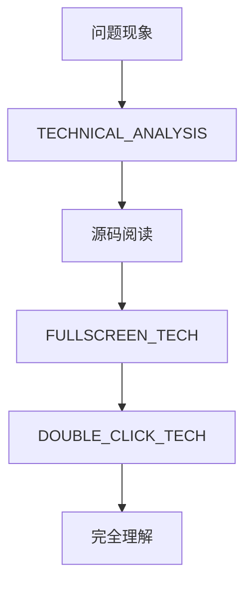
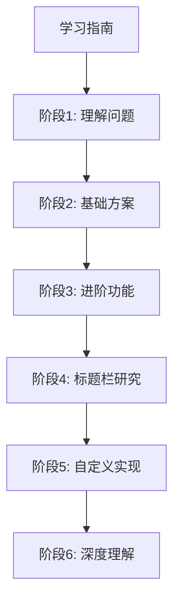

# 🗂️ egui 中文字体支持 - 文档索引

> **项目**: egui 中文字体支持与自定义标题栏实现
> **最后更新**: 2026-01-29

---

## 📚 文档结构

```
dev_logs/chinese_font_analysis/
├── 📘 学习指南_Obsidian.md              # 完整学习路径 (TodoList)
├── 🔬 TECHNICAL_ANALYSIS.md              # 深度技术分析
├── ⚡ QUICK_REFERENCE.md                 # 30秒快速参考
├── 🖥️ FULLSCREEN_TECH.md                # 全屏功能详解
├── 🖱️ DOUBLE_CLICK_TECH.md               # 双击事件详解
├── 🪟 SYSTEM_TITLEBAR_TECH.md            # 系统标题栏原理
└── 🔍 diagnose_titlebar.sh               # 诊断脚本
```

---

## 🎯 快速开始

### 我想...

```dataviewjs
// 学习路径推荐
const tasks = [
    { name: "理解中文显示问题", file: "TECHNICAL_ANALYSIS.md", section: "问题分析", time: "30分钟" },
    { name: "快速配置中文字体", file: "QUICK_REFERENCE.md", section: "快速配置", time: "15分钟" },
    { name: "实现双击最大化", file: "DOUBLE_CLICK_TECH.md", section: "完整实现示例", time: "1小时" },
    { name: "自定义标题栏", file: "SYSTEM_TITLEBAR_TECH.md", section: "方案 D", time: "2小时" },
];

dv.table(["任务", "文档", "预计时间"], tasks.map(t => [
    `[ ] ${t.name}`,
    `[[${t.file}#${t.section}|查看]]`,
    t.time
]));
```

---

## 📖 文档详细说明

### 📘 学习指南_Obsidian.md
> **完整学习路径** - 包含 TodoList 的分步学习指南

**适合**: 想系统学习 egui 中文字体支持和自定义标题栏的开发者

**内容**:
- ✅ 6 个学习阶段（预计 8 小时）
- ✅ 每个阶段的详细任务清单
- ✅ 代码示例和最佳实践
- ✅ 常见问题和调试技巧
- ✅ 经验总结和检查清单

**使用场景**:
```markdown
- [ ] 第一阶段：理解问题
- [ ] 第二阶段：基础解决方案
- [ ] 第三阶段：进阶功能
- [ ] 第四阶段：系统标题栏研究
- [ ] 第五阶段：自定义标题栏实现
- [ ] 第六阶段：深度理解
```

---

### 🔬 TECHNICAL_ANALYSIS.md
> **深度技术分析** - 从源码层面分析中文显示问题

**适合**: 想深入理解 egui 字体系统的开发者

**核心章节**:
1. 问题现象与根本原因
2. 源码分析 (`fonts.rs`, `response.rs`)
3. 解决方案实现
4. 实现细节
5. 最佳实践

**关键代码位置**:
```rust
// crates/epaint/src/text/fonts.rs:288-414
pub struct FontDefinitions {
    pub font_data: BTreeMap<String, Arc<FontData>>,
    pub families: BTreeMap<FontFamily, Vec<String>>,
}

// 替换字符定义
const PRIMARY_REPLACEMENT_CHAR: char = '◻';  // 这就是方块！
```

---

### ⚡ QUICK_REFERENCE.md
> **快速参考卡片** - 30秒快速配置指南

**适合**: 需要快速解决问题的开发者

**内容**:
- 30秒快速配置代码
- 字体查找流程图
- 常见问题 FAQ
- 推荐字体列表

**核心代码**:
```rust
let mut fonts = egui::FontDefinitions::default();
fonts.font_data.insert(
    "中文".to_owned(),
    egui::FontData::from_static(include_bytes!("NotoSansCJK.ttc")).into(),
);
fonts.families.get_mut(&egui::FontFamily::Proportional)
    .unwrap().insert(0, "中文".to_owned());
ctx.set_fonts(fonts);
```

---

### 🖥️ FULLSCREEN_TECH.md
> **全屏功能详解** - F11 全屏和双击最大化原理

**适合**: 想理解窗口全屏机制的开发者

**内容**:
- 系统标题栏 vs 自定义标题栏
- 事件流程图
- 平台差异（Win32/Cocoa/X11/Wayland）
- ViewportCommand 完整列表
- 解决方案对比

**关键概念**:
```
系统标题栏双击:
用户双击 → 窗口管理器处理 → 自动最大化
应用程序无法拦截

自定义标题栏双击:
用户双击 → egui 检测 → 应用处理 → 发送命令
完全由应用控制
```

---

### 🖱️ DOUBLE_CLICK_TECH.md
> **双击事件详解** - 双击检测的完整技术分析

**适合**: 想深入理解事件系统的开发者

**内容**:
1. 实现原理概述
2. 事件检测流程（用户→应用→系统）
3. 源码分析（7个关键文件）
4. 完整实现示例（3种方式）
5. 关键技术点
6. 调试技巧
7. 性能优化

**源码关键点**:
```rust
// Click 结构体
pub(crate) struct Click {
    pub pos: Pos2,
    pub count: u32,  // 1=单击, 2=双击, 3=三击
    pub modifiers: Modifiers,
}

// 双击检测
pub fn button_double_clicked(&self, button: PointerButton) -> bool {
    self.pointer_events.iter().any(|event| {
        matches!(&event, PointerEvent::Released {
            click: Some(c), button: b
        } if *b == button && c.is_double())
    })
}
```

---

### 🪟 SYSTEM_TITLEBAR_TECH.md
> **系统标题栏原理** - 为什么双击系统标题栏不起作用

**适合**: 遇到 Wayland 双击标题栏问题的开发者

**内容**:
- 系统标题栏的归属（不属于应用）
- 双击最大化的完整流程
- 各平台实现差异（Win32/Cocoa/X11/Wayland）
- 为什么 Wayland 上经常不起作用
- 平台对比总结表
- 如何在不同平台启用

**关键发现**:
```
你的环境检测结果：
✅ GNOME 双击设置已启用
❌ 但 winit 的 Wayland 支持有限
❌ 需要合成器支持双击事件

推荐解决方案：
1. 使用 F11 快捷键（已实现）
2. 切换到 X11 会话
3. 实现自定义标题栏
```

---

## 🗺️ 学习路径推荐

### 路径 A: 快速解决问题 (1 小时)


**适合**: 只需要让中文显示正常，不想深入理解

---

### 路径 B: 深入理解 (4 小时)



**适合**: 想深入掌握 egui 原理

---

### 路径 C: 系统学习 (8 小时)



**适合**: 想系统学习 egui 开发

---

## 🔍 按主题查找

### 主题: 字体系统

- [[📘 学习指南_Obsidian.md#第二阶段基础解决方案]]
- [[🔬 TECHNICAL_ANALYSIS.md#源码分析]]
- [[⚡ QUICK_REFERENCE.md]]

### 主题: 双击事件

- [[📘 学习指南_Obsidian.md#第三阶段进阶功能]]
- [[🖱️ DOUBLE_CLICK_TECH.md#实现原理概述]]
- [[🖥️ FULLSCREEN_TECH.md#自定义标题栏]]

### 主题: 窗口控制

- [[📘 学习指南_Obsidian.md#第五阶段自定义标题栏实现]]
- [[🖥️ FULLSCREEN_TECH.md#viewportcommand-命令列表]]
- [[🪟 SYSTEM_TITLEBAR_TECH.md]]

### 主题: 平台差异

- [[🖥️ FULLSCREEN_TECH.md#平台差异对比]]
- [[🪟 SYSTEM_TITLEBAR_TECH.md#平台差异]]

### 主题: Wayland

- [[🪟 SYSTEM_TITLEBAR_TECH.md#linux-wayland]]
- [[🔍 diagnose_titlebar.sh]]

---

## 📊 技术栈

### 核心技术

- **语言**: Rust
- **GUI 框架**: egui 0.33.3
- **窗口库**: winit (via eframe)
- **渲染**: wgpu
- **字体**: Noto Sans CJK

### 依赖关系

```
你的应用
    ↓
eframe (应用框架)
    ↓
egui (GUI 库)
    ↓
epaint (2D 图形)
    ↓
winit (窗口抽象)
    ↓
操作系统 API
```

---

## 💡 使用建议

### 在 Obsidian 中使用

1. **克隆此仓库**:
   ```bash
   git clone https://github.com/emilk/egui.git
   ```

2. **在 Obsidian 中打开文件夹**:
   ```
   打开 Obsidian → 打开文件夹 → 选择 egui 仓库
   ```

3. **使用图谱视图**:
   - 点击左侧 `🗺️ 图谱`
   - 查看 `chinese_font_analysis` 的文档关系
   - 点击节点跳转到相关文档

4. **使用反向链接**:
   - 查看哪些文档引用了当前文档
   - 快速找到相关内容

5. **使用 Dataview 插件**:
   - 安装 Dataview 插件
   - 运行文档中的查询
   - 获取动态文档列表

### 学习建议

1. **按顺序阅读**: 从学习指南开始，跟着 TodoList 一步步来

2. **边学边做**: 每学一个概念就运行代码验证

3. **记录笔记**: 在 Obsidian 中添加自己的笔记

4. **查看源码**: 阅读关键源码文件加深理解

---

## 🔗 外部资源

### 官方文档

- [egui 官方文档](https://docs.rs/egui)
- [eframe 官方文档](https://docs.rs/eframe)
- [egui GitHub](https://github.com/emilk/egui)

### 字体资源

- [Noto Sans CJK (Google)](https://github.com/googlefonts/noto-cjk)
- [文泉驿](https://wenq.org/)
- [站酷字体](https://zcool.com.cn/fonts)

### 社区

- [egui Discord](https://discord.gg/JFcEma9bJq)
- [GitHub Discussions](https://github.com/emilk/egui/discussions)

---

## 📝 更新日志

### 2026-01-29
- ✅ 创建完整学习指南
- ✅ 添加 6 个学习阶段
- ✅ 编写 TodoList 清单
- ✅ 添加技术分析文档
- ✅ 实现自定义标题栏示例

---

## 🏷️ 标签

#egui #rust #gui #字体 #中文字体 #窗口管理 #wayland #自定义标题栏 #双击事件 #全屏 #学习指南

---

*文档维护: @clearzero22*
*最后更新: 2026-01-29*
